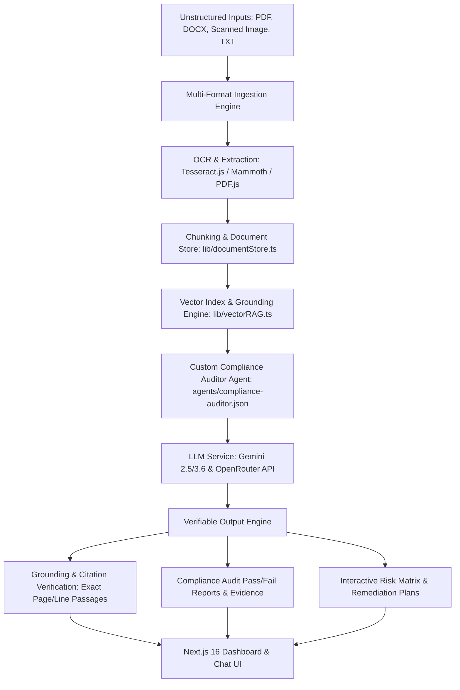

# Knowledge & Compliance Agent — Architecture Specification

## Executive Overview
**Knowledge & Compliance Agent** is an enterprise-grade AI system engineered for **Track C: Knowledge and Compliance Agents**. The application ingest messy, unstructured inputs (PDFs, DOCX, TXT, OCR scanned images) and transforms them into structured, verifiable audit reports, grounded Q&A responses, and automated risk matrix assessments with precise, passage-level citations.

---

## 1. High-Level System Architecture



---

## 2. Technology Stack

- **Framework**: [Next.js 16 (App Router)](https://nextjs.org/) with React 19 & TypeScript 5
- **Styling**: Modern Tailwind CSS v4 with glassmorphism UI & custom dark theme
- **AI Core**: Google Gemini (`@google/genai`, `@google/generative-ai`) and OpenRouter API (`openai` SDK / `axios`)
- **Document Parsing & OCR Engine**:
  - `tesseract.js` for scanned document & image OCR processing
  - `pdfjs-dist` & `@napi-rs/canvas` for high-fidelity PDF extraction
  - `mammoth` for DOCX contract parsing
  - `adm-zip` for archive processing
- **Grounding & RAG Vector Engine**: Local in-memory/file vector index (`lib/vectorRAG.ts` & `lib/documentStore.ts`) with TF-IDF cosine similarity vector scoring and exact line/page indexing.
- **CI/CD & Automation**: GitHub Actions workflow (`.github/workflows/ci.yml`)

---

## 3. Data Models & Schemas

### Document & Chunk Schema
```typescript
export interface DocumentChunk {
  id: string;
  documentId: string;
  pageNumber?: number;
  lineNumberStart?: number;
  lineNumberEnd?: number;
  content: string;
  vector?: number[];
}

export interface ParsedDocument {
  id: string;
  name: string;
  mimeType: string;
  uploadTimestamp: string;
  rawText: string;
  chunks: DocumentChunk[];
  metadata: {
    pageCount?: number;
    wordCount: number;
    extractedVia: 'pdfjs' | 'mammoth' | 'tesseract-ocr' | 'raw-text';
  };
}
```

### Compliance Rule & Audit Schema
```typescript
export interface ComplianceRule {
  id: string;
  category: 'GDPR' | 'HIPAA' | 'ISO27001' | 'SOC2' | 'Custom';
  title: string;
  description: string;
  severity: 'CRITICAL' | 'HIGH' | 'MEDIUM' | 'LOW';
}

export interface AuditItemResult {
  ruleId: string;
  ruleTitle: string;
  status: 'PASS' | 'FAIL' | 'NEEDS_REVIEW';
  confidenceScore: number; // 0.0 - 1.0
  evidence: {
    passageText: string;
    documentName: string;
    pageNumber?: number;
    lineNumberRange?: string;
  }[];
  riskReasoning: string;
  remediationAction?: string;
}

export interface AuditReport {
  id: string;
  documentId: string;
  timestamp: string;
  overallScore: number; // 0 - 100%
  items: AuditItemResult[];
  summary: string;
}
```

---

## 4. Grounding & Anti-Hallucination Engine

To comply strictly with **Track C Grounding & Citation rules**:
1. **Refusal to Invent**: If a query or compliance check lacks evidence in uploaded documents, the agent explicitly responds with a standard fallback ("*Information not available in source documents*") and refuses to generate synthetic facts.
2. **Exact Passage Citations**: Every claim is mapped back to its source `documentId`, `pageNumber`, `lineNumberRange`, and exact verbatim snippet.
3. **Verifiable Audit Evidence**: Compliance pass/fail evaluations attach verbatim quotes from the target document alongside confidence scores.

---

## 5. Security & Deployment

- Environment variables stored in `.env.local` (`GEMINI_API_KEY`, `OPENROUTER_API_KEY`).
- Stateless serverless API routes on Next.js 16 App Router.
- Built and verified via automated CI pipeline (`.github/workflows/ci.yml`).
